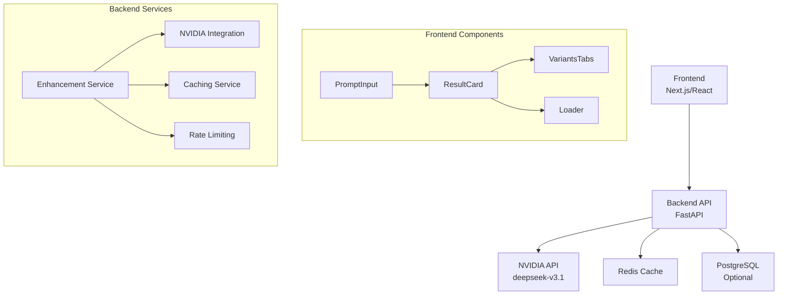

# PromptForge AI - System Architecture

## 🏗️ Overall Architecture



## 🔧 Technology Stack

### Backend (FastAPI)
- **Framework**: FastAPI
- **API Client**: httpx (async)
- **Caching**: Redis
- **Database**: PostgreSQL (optional)
- **Authentication**: JWT (future)
- **Rate Limiting**: Custom middleware

### Frontend (Next.js)
- **Framework**: Next.js 14+ (App Router)
- **Styling**: Tailwind CSS
- **State Management**: React hooks
- **HTTP Client**: Axios or fetch
- **UI Components**: Custom components

### External Services
- **AI Model**: NVIDIA API (deepseek-v3.1)
- **Deployment**: Vercel (frontend) + Railway/Render (backend)

## 📦 Component Architecture

### Backend Components
1. **Enhancement Service** - Core prompt optimization logic
2. **NVIDIA Integration** - API client for deepseek-v3.1
3. **Caching Service** - Redis-based response caching
4. **Rate Limiting** - Request throttling middleware
5. **Validation Service** - Input sanitization and validation

### Frontend Components
1. **PromptInput** - Main text input component
2. **ResultCard** - Display optimized prompt and score
3. **VariantsTabs** - Creative/Technical/Concise variants
4. **Loader** - Loading state component
5. **CopyButton** - Clipboard functionality
6. **HistoryPanel** - Previous prompts (optional)

## 🔄 Data Flow

1. **User Input** → Frontend validates and sends to backend
2. **Backend** → Checks cache, applies rate limiting
3. **NVIDIA API** → Processes prompt with system prompt
4. **Response Processing** → Parses JSON, applies caching
5. **Frontend Display** → Renders results with variants

## 🗂️ Project Structure

```
promptforge-ai/
├── backend/
│   ├── app/
│   │   ├── api/
│   │   │   └── endpoints/
│   │   ├── core/
│   │   ├── services/
│   │   └── models/
│   ├── tests/
│   └── requirements.txt
├── frontend/
│   ├── app/
│   ├── components/
│   ├── lib/
│   └── styles/
└── docs/
```

## 🔒 Security Architecture

- **Input Validation**: Max length, content filtering
- **API Key Management**: Environment variables
- **Rate Limiting**: Prevent abuse
- **CORS**: Configured for frontend domain
- **Prompt Injection**: Basic filtering

## ⚡ Performance Considerations

- **Caching**: Redis for identical prompts
- **Async Processing**: Non-blocking API calls
- **Response Optimization**: Minimal payload size
- **CDN**: Static assets delivery

## 📊 Monitoring & Analytics

- **Logging**: Request/response logging
- **Metrics**: Response times, error rates
- **Analytics**: Usage patterns (future)

This architecture provides a scalable foundation for the PromptForge AI SaaS with clear separation of concerns and performance optimization.